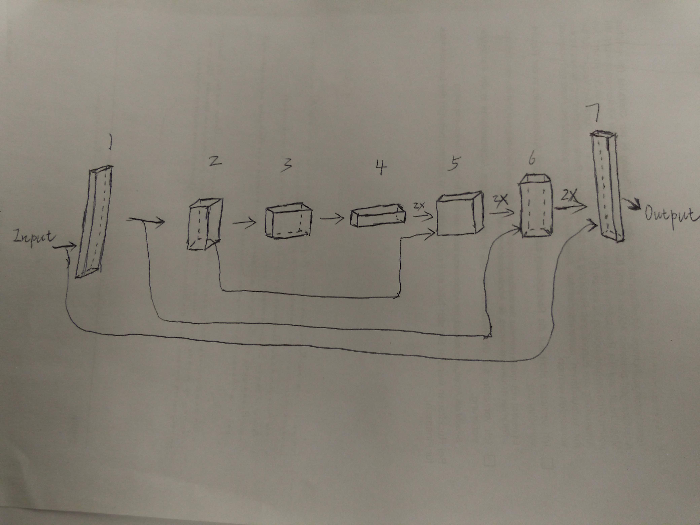
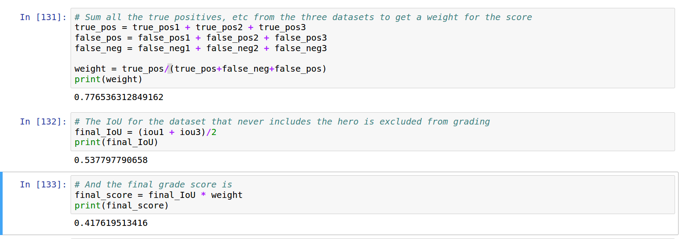
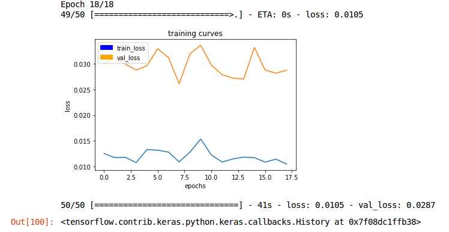

# Follow_me
This repository is established for the Udacity project 4 in nanodegree program
---
## Project: Follow_me

---

```

###Steps to complete the project

---

1. Set up the anaconda and python 3.5 environment, RoboND in starterkit from project 1 could be directly utilized as the python environment.
2. Download or clone the [project repository](https://github.com/udacity/RoboND-DeepLearning-Project.git) onto the local pc.  
3. Grab training validation and sample evaluation data [data repository](https://s3-us-west-1.amazonaws.com/udacity-robotics/Deep+Learning+Data/Lab), you could alternatively use the data collected by yourself in simulator.
4 .Run the code in jupyter notebook in "*/RoboND-DeepLearning-Project-master/code/model_training" to train the model, you could either run then training process either on the AWS or on local PC with NVIDAIA GPU, with CUDA and cuDNN the training process could be speeded up significantly.
5. Fill in the "model_training" with my own code. 
6. Run the simulator and select the "follow model" and start the script "follower.py", after the step above, the weights should be stored in the data folder, and the follower.py could load the model to complete the following process.

---

## Network architecture 
### 1. Layer explanation
The overall architecture for the network is composed of encoder and 1x1 convolution and the decoder, the encoder accounts for the feature recognition, so with the depth increases, the feature is extracted into a hierarchical  structure. The 1x1 convolution is applied when the spatial  information or location should be retained in the network. The skip connection technique is applied to refine the environment with the combination of different image resolutions.

<br />&emsp; &emsp;  &emsp;  &emsp; &emsp; &emsp;  &emsp;  &emsp; &emsp; &emsp;  &emsp;  &emsp;&emsp; &emsp;  &emsp;  &emsp;Network structure<br />
The sketch above depicts the model utilized for this project, the layer with index from 1 to 3 belongs to encoder, 4 is the 1x1 convolution layer, from 5 to 7, these layers build up the decoder. The arrow depicts the direction of information transmission from input, all the way up to output. The three skip connection lines from input, first and second output are >connected to layer with the output from the adjacent layer at decoder side.
### 2. Hyperparameters
Hyperparameters:
'''
learning_rate = 0.001
batch_size = 50
num_epochs =18
steps_per_epoch = 50
validation_steps = 50
workers = 16
'''
Full configuration details for hyperparameters are listed as above. 
<b>The learning rate</b> shoud be neither too large, possibly resulting in the divergence of the cross-entropy function, nor too small, causing the training too time consuming. Through the trade-off between speed and the accuracy this value is adopted.<br />
1 <b>Batch size</b> This number determines how many images in each batch to be fed into the training network. Too large will lead to the ambiguity of the classifier, unable to extract the features from training set properly, through my test, the value ranging in 20-50 works well  for the process. The final batch size value in this model is set to 30. <br />
2 <b>Num_epochs</b> is the time, the same dataset goes through the training model. Through the cross-entropy function for validation and training I found this value should be appropriate, resulting in the cost function still going downward before the overfitting occurs, and it makes training time simutaneously shorter. <br /> 
3 <b>steps_per_epoch</b>, number of batches that go through the network in each epoch. This should be determined with the whole size of images in training set divided by the batch size, in my case, the size of training images is about 1200 and the integer 30 is applied. <br />
4 <b>validation_steps</b>: number of batches of validation images that go through the network in each epoch. similar to steps_per_epoch, a default value is kept. <br />
5 <b>workers</b>: maximum number of processes to spin up. With my hardware specs, I found this number will not run out of my computational resources on my pc, and it speeds up my training process simultaneously. <br />
### 3. Fully connected network with 1*1 convolution 
1x1 convolution is used to keep the 4D tensor with the spatial information instead of flattening the output into 2D tensor in the fully connected output:
'''
    intermediate_layer = conv2d_batchnorm(encoder_layer3, filters = 256, kernel_size=1, strides=1)
'''
This code snippet depicts the 1x1 convolution, number of kernels is same as the number of input, only the stride and kernel size all set to be 1.
Another merit for 1x1 convolution is the reduction of the tuning parameters relatively, compared to the fully connected output layer, preventing the model from overfitting. And it makes the structure deeper with some more parameters, which is implemented in matrix multiplication instead of costly convolution. 

### 4. Encoding and decoding methods
The encoder is responsible for the feature extraction, the deeper each layer is, the more parameters for training is produced, for this project the layer is set to 3, and the depths in each layer increases with the forward direction, the depth is from 16 at first layer to 64 at last layer. The stride for the convolution is set to 2 for each layer, which produces the half of the dimensions both in height and the width of image after filter. After each layer in encoder the separable layer Implementation for both are provided to convolute the each image into different depth channel separately, instead of with 3 Dimensions' kernel for convolution, this will reduce the parameters for training, after that, the batch normalization with the ReLU activation function is applied to each layer to normalize the output and make the output positive:
'''
    encoder_layer1 = encoder_block(inputs, 32, 2)   
    encoder_layer2 = encoder_block(encoder_layer1, 64, 2)
    encoder_layer3 = encoder_block(encoder_layer2, 128, 2)
'''
 The code snippet above is the encoder part, connected adjacently and the second parameter is for the depth, the third for stride.
Decoder number is same as the number at encoder, but the size decreases from layer to layer, this transposed convolution will make the output exactly same size of input and additionally with the spatial information, the transposed convolution is used to swap the result from encoder to generate the image with spatial property. In each layer of decoder, the output is also via skipping connection technique to combine the layers with different resolutions:
'''
    decoder_layer1 = decoder_block(intermediate_layer,encoder_layer2, 128)
    decoder_layer2 = decoder_block(decoder_layer1, encoder_layer1, 64)
    decoder_layer3 = decoder_block(decoder_layer2, inputs, 32)
'''
These three lines from the fcn_model account for the deconvolution,  with the combinaton of layer being used,  the small size layer and large size layer both assigned correspondingly to the arguments of call function. But too many skipping connection may also lead to the explosion of output.
### 5. Possibility to expand the model onto other objects
This model should be to some extent not feasible for the following the cat or dog. Because the depth is not enough to extract some small features from the small animal, but with some modification within the layer it may be possible, like the kernel size or the stride should be modified to a lower ones, in order to make the zoom in effect for convolution more precise,  in order to collect more information from the small valid area in the image. Accordingly the hyperparameters should be tweaked again to attain a good performance.

The obtained model thorough the training for hero, therefore the weights in this model should be not applicable for recognition of some pets, 
because I read throuhg a tutorial forum [link](http://forums.fast.ai/t/my-note-on-lesson-1-image-recognition-cats-dogs-a-cognitive-use-case-by-implementing-a-supervised-learning-for-image-classification/6284), they used a more complicated supervised deep learning method to train a classifier for recognition of cat and dog, the more layers are involved to extract more small patterns from these kind of targets, at the encoder side, VGG-16 is deployed by a lot of networks, which works quite well to complete the recognition of cat and dog. So I thought the modification should bring our model in combination with pre-trained model, attained from the online image database using VGG-16 to extract model features,  then connecting the pre-trained model to our 1x1 convolution and decoder, which may produce a goog performance, otherwise we may need to get a lot of pets dataset for the retraining.
### 6. Modification to improve the IoU to the required level
1 <b>Merged the default training data with data collected in detection and patrol without target scenario, in this way the wrong predictions could be counteracted</b> <br /> 
2 <b>Ran the dasta on AWS, with GPU, the training process is virtually speeded up, only to take several minutes instead of several hours before</b> <br /> 
3 <b>Increased the depth ineach layer, at encoder side, 32-> 64 -> 128 rather than 16 -> 32 -> 64, 1x1 convolution with filters 256, decoder 128 -> 64 -> 32 </b> <br /> 
4 <b>Reduced Num_epochs to  18 before overfitting, simutaneously with the valiation loss, at 0.0287 and training loss at 0.0105</b> <br /> 
## Result analysis and summary 
I have trained my fcn model with two pairs' datasets, one is from online repository, the other produced by myself in simulator, with the advice from the tutorial, I collected the data mainly in three scenarios:
1 Patrolled over the whole area with different height to cover as more distractions as possible.
2 Made the hero zigzagging while the drone hovering over on her side to get more feature from different angles.
3 Spawned the hero in a bunch of people, to provide more data for detection training. This also contributes to the segmentation of the other characters.

<br />&emsp; &emsp;  &emsp;  &emsp; &emsp; &emsp;  &emsp;  &emsp; &emsp; &emsp;  &emsp;  &emsp;&emsp; &emsp;  &emsp;  &emsp;Metric IOU for merged training dataset<br />
The snapshot above shows the average IoU value for the hero detection, approximately 42% is obtained with the tuned hyperparameters.


<br />&emsp; &emsp;  &emsp;  &emsp; &emsp; &emsp;  &emsp;  &emsp; &emsp; &emsp;  &emsp;  &emsp;&emsp; &emsp;  &emsp;  &emsp;Plot of cost vs epoch<br />
This is the plot corresponding to the training with merged dataset with about 5000 images.

This last one is the plot corresponding to the new dataset. The cross function for training decreases rapidly after the first epoch and then slowly with more epochs, but it proves the outcome is still improving, while the cost for the validation is almost unchanged from 1st epoch, the order of magnitude stay around one decimal. Even the overfitting occurs after 9th epoch.
## Future Enhancements	
A convolution is a significantly slower operation than, say both forward and backward propagation, even with maxpooling. If the network is pretty deep, each training step is going to take much longer, due to the computational complexity increase, for application like, pre- trained model, the fully convolution model is a little too complicated for it.
Maybe some Inception structure is more efficient for the following dog and cat, just with less depth but still combines the sliding over image with different kernels, to generate a classifier with less computational complexity.
Even the occlusion surrounding the hero could have a bad impact on the training dataset, so if a hand_off setting is introduced, the performance for hero in crowd would be better hopefully.
